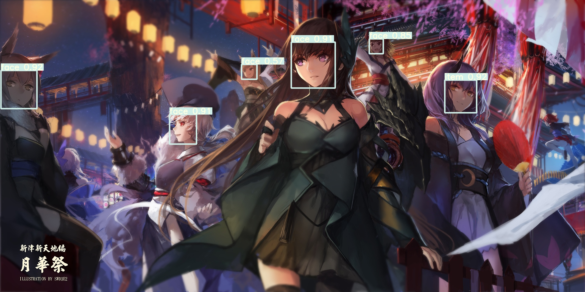
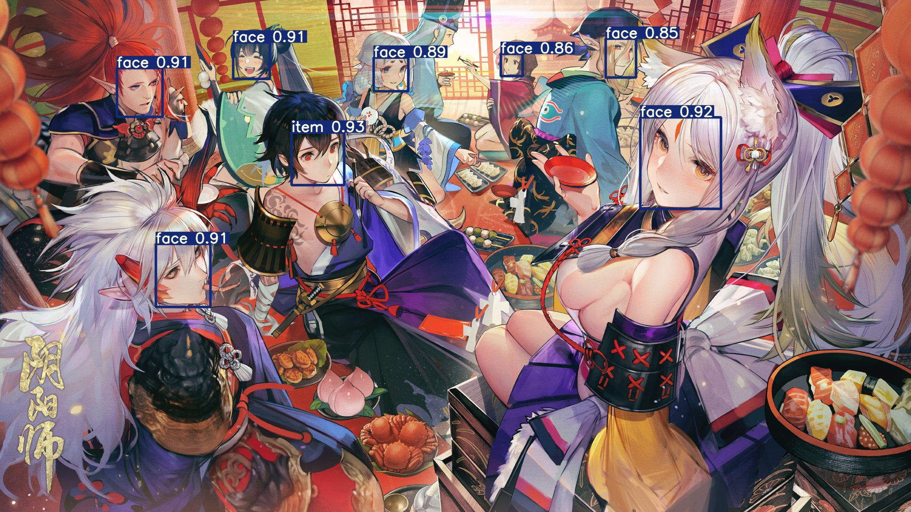
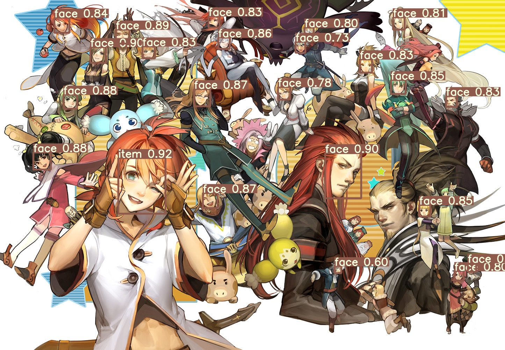
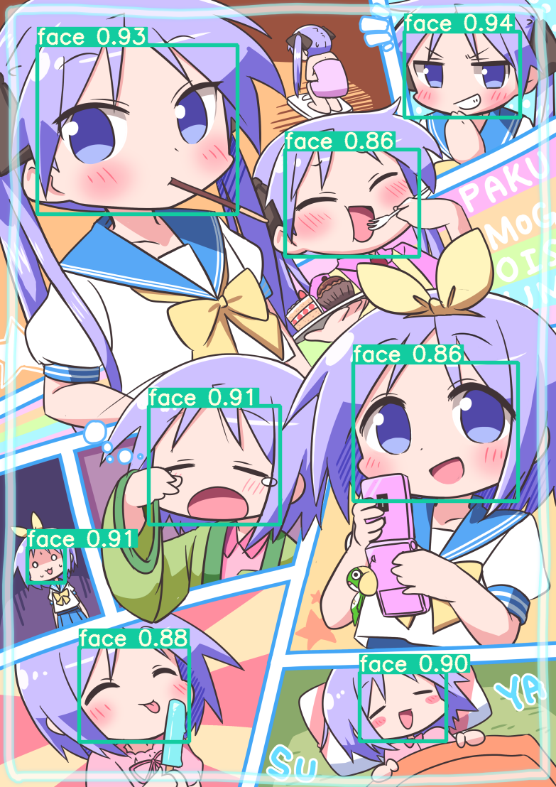
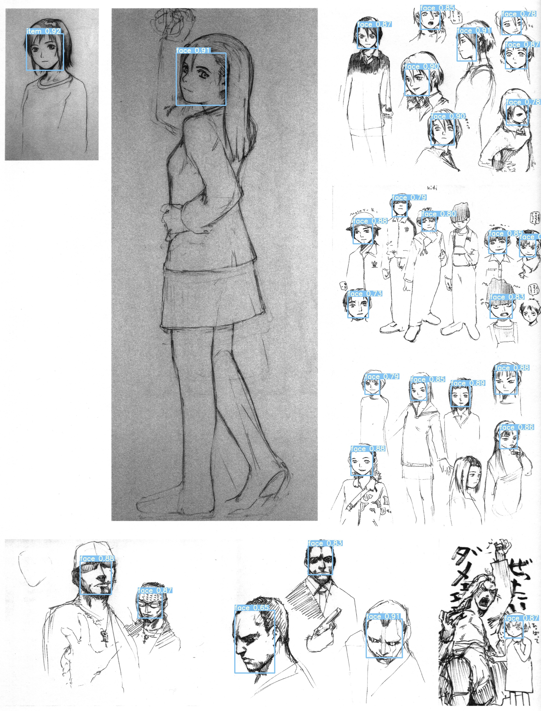

# yolov5_anime
An anime face detector based on [yolov5](https://github.com/ultralytics/yolov5).

The training set used contains 5845 manually selected and annotated anime pictures from pixiv. The test set encompasses 655 randomly selected pictures from the [daily rankings on pixiv](https://www.pixiv.net/ranking.php).

Two separate models based on the configuration of yolov5x and yolov5s respectively are provided. Performance distinctions can be found in the [demo](#Demo) section.

## Requirements
Python 3.8 or later with all [requirements.txt](https://github.com/zymk9/yolov5_anime/blob/master/requirements.txt) dependencies installed.

## Usage
1. Clone the repository and run install requirements. **Beware that the weights and models provided here may be only compatible to the [yolov5 2.0 release](https://github.com/ultralytics/yolov5/releases/tag/v2.0).**
   
   Update: the models are still compatible with [release 3.0](https://github.com/ultralytics/yolov5/releases/tag/v3.0) 
    ```bash
    $ git clone https://github.com/zymk9/yolov5_anime.git 
    $ cd yolov5
    $ pip install -qr requirements.txt  # install dependencies
    ```
2. Retrieve yolov5x weights from [Google Drive](https://drive.google.com/file/d/1-MO9RYPZxnBfpNiGY6GdsqCeQWYNxBdl/view?usp=sharing) or use the following code.
    ```python
    # retrieve weights for model based on yolov5x
    from utils.google_utils import gdrive_download 
    gdrive_download('1-MO9RYPZxnBfpNiGY6GdsqCeQWYNxBdl','yolov5x_anime.pt')
    ```
    The weights for yolov5s can be found in the [weights](https://github.com/zymk9/yolov5_anime/tree/master/weights) folder.
3. Run detection on your data.
    ```bash
    $ python detect.py --weights path/to/model --source path/to/images --output path/to/output/folder
    ```
    You can also set `--conf-thres` and `--iou-thres`, or enable test time augmentation using `--augment` (no significant performance gain on test set). Refer to [detect.py](https://github.com/zymk9/yolov5_anime/blob/master/detect.py) for more arguments. 

    For yolov5x, the recommended and default threshold for confidence is 0.8 if high resolution faces are desidered. However, if you want to detect more varieties, scales or angles of faces, 0.5 can be a reasonable value.

    For yolov5s, you may need to lower `--conf-thres` to 0.5.

## Demo
The performance on test set using [test.py](https://github.com/zymk9/yolov5_anime/blob/master/test.py) with `--conf-thres=0.5 --ious-thres=0.5`
```
performance of yolov5x_anime
--------------------------------------------------------------------------------------------------
Images      Targets     P       R       mAP@.5      mAP@.5:.95
655         873         0.964   0.95    0.947       0.518

Speed: 22.6/1.5/24.1 ms inference/NMS/total per 640x640 image at batch-size 32, using a Tesla P100
--------------------------------------------------------------------------------------------------

performance of yolov5s_anime
--------------------------------------------------------------------------------------------------
Images      Targets     P       R       mAP@.5      mAP@.5:.95
655         873         0.959   0.955   0.953       0.582

Speed: 3.4/1.3/4.6 ms inference/NMS/total per 640x640 image at batch-size 32, using a Tesla P100
--------------------------------------------------------------------------------------------------
```
The performances are comparible. However, with a higher confidence threshold, yolov5x can significantly outperform yolov5s.

The model works with multi-scale, multi-view faces, including manga and other styles. Pictures are taken from yolov5x output.


Origin: [【PFT】-月華祭-](https://www.pixiv.net/artworks/55817439) by [swd3e2](https://www.pixiv.net/users/660788)

Origin: [新年愉悦](https://www.pixiv.net/artworks/67321023) by [Liduke(日子)](https://www.pixiv.net/users/38088)

Origin: [Tales of abyss Only cover](https://www.pixiv.net/artworks/66546900) by [Liduke(日子)](https://www.pixiv.net/users/38088)

Origin: [いつものふたり](https://www.pixiv.net/artworks/82867235) by [うにょーん](https://www.pixiv.net/users/123423)

Origin: *an omnipresence in wired／『lain』 安倍吉俊画集 オムニプレゼンス* by 安倍 吉俊

## Training
An official toturial from Ultralytics can be found [here](https://github.com/ultralytics/yolov5/issues/12) if you want to train your own model.

The yolov5x_anime was trained for about 40h on a single Tesla P100 for 326 epochs, using SGD and without multi-scale training. The script is following
```bash
$ python train.py --hyp ./data/hyp.finetune.yaml --single-cls --cache-images --batch-size 16 --epochs 360 --data ./data/anime.yaml --cfg ./models/yolov5x.yaml --weights yolov5x.pt
```

The model of yolov5s_anime underwent 480 epochs in 14h, using `--adam` and `--multi-scale`.


